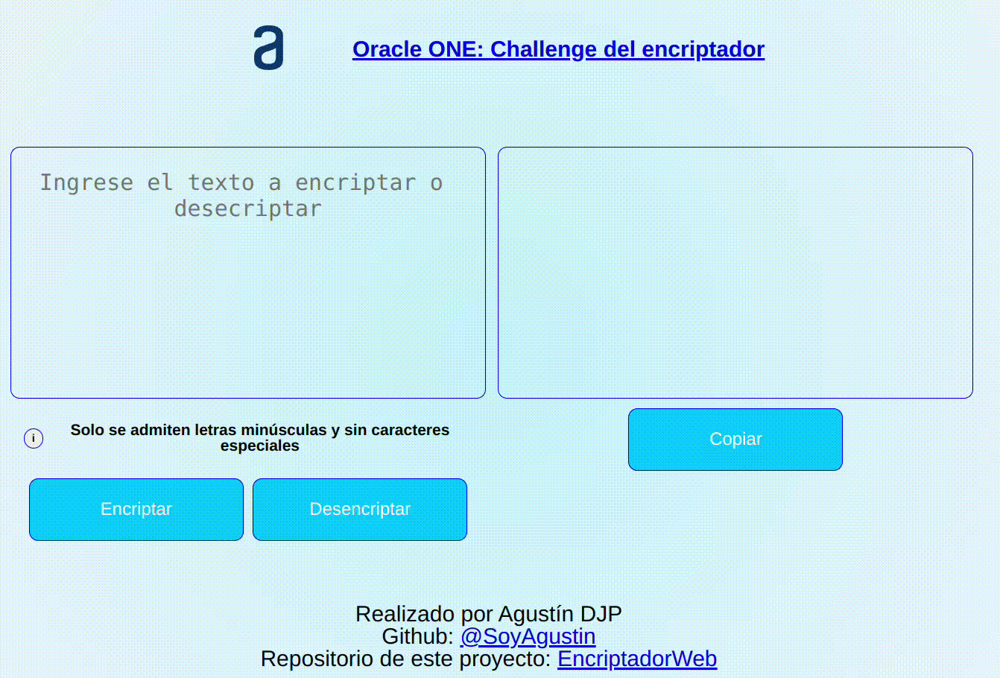

# [Oracle one: Challenge del encriptador](https://www.aluracursos.com/challenges/oracle-one/sprint01-construye-un-encriptador-texto-con-javascript)

[¡Puede probar el encriptador haciendo click aqui!](https://soyagustin.github.io/EncriptadorWeb/)

##  Descripción
Se presenta una encriptador de texto simple con el objetivo de implementar los conocimientos adquiridos acerca de **HTML** , **CSS** y **Javascript**. 

Se implementaron metodologías de código limpio, buenas prácticas y en el caso del código de CSS y Javascript se presentan comentarios concretos acerca de cada bloque y su funcionalidad. 

## Reglas del challenge
El encriptador de texto hace un mapeo sencillo de las vocales de una cadena de texto de la siguiente forma:

`La letra "e" es convertida para "enter"`

`La letra "i" es convertida para "imes"`

`La letra "a" es convertida para "ai"`

`La letra "o" es convertida para "ober"`

`La letra "u" es convertida para "ufat"`

Una regla adicional es que el encriptador solo debía recibir cadenas con letras minúsculas de la `a` a la `z` sin caracteres especiales.
## ¿Cómo se superó el challenge?
### Encriptado
Se realizó el mapeo de encriptacion con el uso de `diccionarios` y un algoritmo simple de búsqueda de carácter por carácter dentro de una cadena con un `for loop`  anidado

### Desencriptado 
Para la desencriptacion se utilizó un método basado en la coincidencia con expresiones regulares (`regex`)  sobre el diccionario con llaves y valores invertidos de encriptacion dentro de un `for loop`

### Funciones extra
- Para evitar que el usuario ingresara caracteres especiales o mayúsculas se implementó una función basada nuevamente en la coincidencia de expresiones regulares.
- Botón para copiar el resultado al portapapeles.
- Animación de colores para los botones y las áreas de texto.
- Diseño y animaciónes de los botones responsivas.

